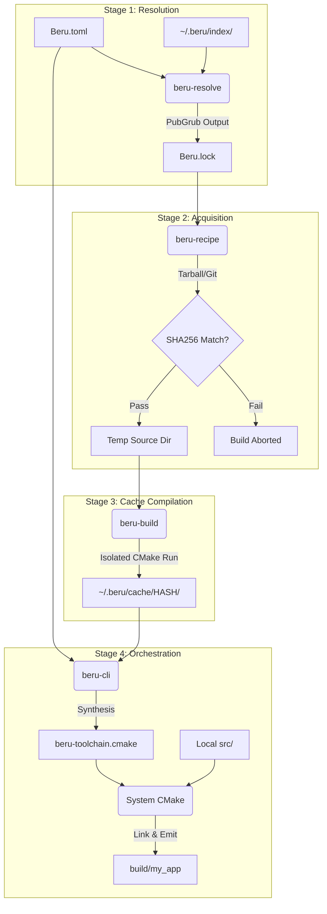

# Architecture Deep Dive

Understanding the internal architecture of Beru provides invaluable context for debugging complex build failures and reasoning about the orchestrator's behavior. 

Beru is written entirely in Rust and utilizes a multi-crate workspace. This chapter deconstructs the architecture, tracing the execution of a `beru build` command from the initial TOML parse to the final emitted assembly code.

---

## 1. The Four-Stage Pipeline

The Beru orchestrator operates as a strict, unidirectional pipeline. State flows downward through four specialized Rust crates.

### Stage 1: Parsing and Resolution (`beru-manifest` & `beru-resolve`)
When `beru build` is invoked, the `beru-manifest` crate reads the local `Beru.toml`. It performs syntax validation (ensuring the `cxx-std` is valid, package names are compliant, etc.) and constructs a strongly typed representation of the project in memory.

Control is then passed to `beru-resolve`. This crate acts as the integration layer for the PubGrub algorithm. It traverses the local Git index (`~/.beru/index/`), evaluates version constraints, and computes the mathematical dependency graph. The output of this stage is the `Beru.lock` file, representing a flattened, conflict-free list of exact package versions.

### Stage 2: Acquisition and Verification (`beru-recipe`)
With the exact versions known, the pipeline must acquire the source code. The `beru-recipe` crate iterates over the locked graph. For each node, it reads the corresponding `recipe.toml` from the index.

If the recipe specifies a tarball URL, Beru streams the download into memory. **Before writing to disk**, it hashes the buffer. If the computed SHA-256 hash does not exactly match the `sha256` string in the recipe, the memory buffer is zeroed and the build aborts with a fatal security violation. If verified, the source is extracted into a temporary staging directory.

### Stage 3: The Cache Build Engine (`beru-build`)
This is where compilation begins. The `beru-build` crate is responsible for populating the global binary cache (`~/.beru/cache/`). 

For each un-cached dependency, Beru spins up an isolated CMake process targeting the staging directory. It injects specific flags ensuring the dependency is built using the exact compiler and C++ standard required by the root project. 

The resulting artifacts (static archives `.a`/`.lib`, shared objects `.so`/`.dll`, and headers) are installed into a unique prefix within `~/.beru/cache/`. This prefix is a cryptographic hash of the compiler version, architecture, C++ standard, and package version. This ensures that different compiler ABI configurations never overwrite each other in the cache.

### Stage 4: Orchestration and Final Link (`beru-cli`)
With all dependencies safely compiled and cached, control returns to the top-level `beru-cli` runner. 

The CLI synthesizes the `beru-toolchain.cmake` file inside the local project root. This file iterates over the dependency graph, injecting `CMAKE_PREFIX_PATH` variables that point precisely to the hashed directories in the global cache.

Finally, Beru invokes the system's `cmake` and `cmake --build` commands against the user's local source code, injecting the synthesized toolchain. The compiler locates the cached headers, the linker locates the cached archives, and the final executable is emitted into the `build/` directory.

---

## 2. Visualizing the Pipeline

---

## 3. Cache Invalidation and Poisoning Prevention

Beru's speed relies on its global cache. However, a poisoned cache (where a binary was compiled with different flags than expected) leads to catastrophic, hard-to-debug linker errors.

To prevent poisoning, Beru's cache keys are hypersensitive. The cache for `fmt 10.2.1` is not stored at `~/.beru/cache/fmt/10.2.1/`. It is stored at `~/.beru/cache/fmt/10.2.1/<HASH>/`.

This HASH is computed by hashing the following inputs:
1.  **The Compiler Signature:** Beru runs `c++ --version` and hashes the exact output. If you upgrade from GCC 11 to GCC 12, the hash changes, and Beru will safely recompile all dependencies from scratch without you asking.
2.  **The C++ Standard:** `c++17` produces a different hash than `c++20`. This prevents ABI mismatch between different standard library layouts.
3.  **The Build Profile:** A `debug` build (unoptimized, with sanitizers) produces a different hash than a `release` build.

This rigorous hashing strategy ensures that you never have to manually run `beru clean` on the global cache; Beru manages environmental changes safely and automatically.
